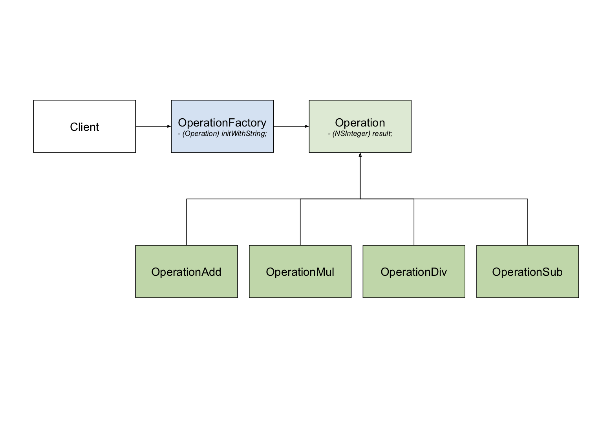

# FactoryMethod

## Type
Creation

## Purpose
We use FactoryMethod to create instances without specific exactly classes, and client use common interface to create new type of instances.

## Design

## Demo
Operation factory create add operator, substract operator, mulitlication operator, and division operator. 

